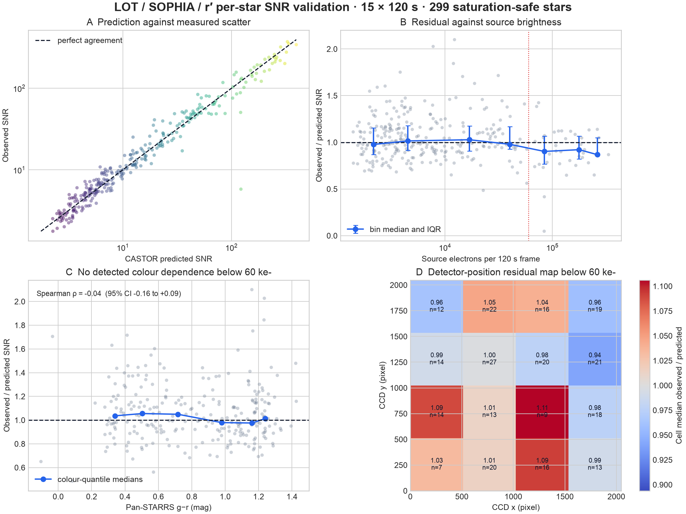
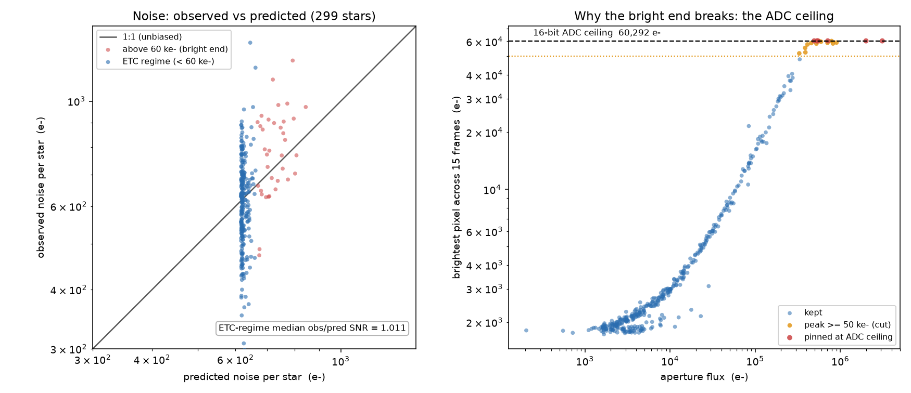

# LOT r' per-star end-to-end residual analysis

This is the star-level version of the binned result in `endtoend.py`. It uses
the same fifteen 120 s LOT/SOPHIA r' frames from 2025-11-06 and applies the
final saturation selection: every retained star remains below 50,000 e- peak
in every frame, clear of the 60,292 e- 16-bit ADC ceiling.



Two further per-star views the binned table cannot show:



The left panel is the model-free validation: predicted against observed noise
for every star, with the 1:1 line. The faint majority pile up at the sky-plus-
read floor near 600 e-, scattering symmetrically about the line, and the ETC-
regime median lands at obs/pred 1.011. The right panel is the bright-end story
in one plot: each star's brightest pixel against its aperture flux, flattening
hard at the 60,292 e- 16-bit ADC ceiling. Six stars are pinned there and
another handful clear the 50,000 e- peak cut, which is why the headline sample
is restricted to saturation-safe stars rather than showing a spurious noise
floor. Regenerate with
`uv run --with pandas --with matplotlib python validation/analyze_noise_scatter.py`;
the per-star peaks come from the committed
`data/lot_r_endtoend_peak_vs_flux.csv`.

## Result

| Selection | Stars | Median observed/predicted | IQR | Bootstrap 95% CI of median |
|---|---:|---:|---:|---:|
| All saturation-safe stars | 299 | 0.995 | 0.888–1.151 | 0.976–1.039 |
| ETC regime, flux < 60 ke- | 261 | **1.011** | 0.902–1.168 | 0.980–1.050 |

The current CASTOR noise model is unbiased at the population level on this
night: the ETC-regime median is +1.1% from perfect
agreement. The broad per-star scatter is expected in part because every
observed noise is itself estimated from only 15 frames (`sigma_relerr = 18.9%`).

## Residual checks in the ETC regime

The table reports Spearman rank correlations. Confidence intervals bootstrap
stars 5,000 times; an interval crossing zero means this night does not resolve
a monotonic trend.

| Residual against | Stars | Spearman rho | Bootstrap 95% CI |
|---|---:|---:|---:|
| log10 source flux | 261 | +0.036 | -0.084 to +0.157 |
| Pan-STARRS g-r colour | 257 | -0.036 | -0.162 to +0.090 |
| CCD x | 261 | -0.084 | -0.208 to +0.038 |
| CCD y | 261 | -0.082 | -0.203 to +0.040 |
| distance from CCD centre | 261 | -0.079 | -0.199 to +0.041 |

No tested variable has a resolved monotonic relationship with the residual.
In particular, the colour result uses 257 catalogue-quality
stars and gives no evidence that source colour changes the *noise-model*
accuracy in r'. This does not replace a photometric colour-term fit, which is a
separate test of the count-rate calibration.

The 4x4 detector map uses the same below-60-ke- selection and has noisy cells
(some contain only a handful of stars),
but no coherent centre-to-edge trend; the global radial correlation above is
the appropriate summary. The mild downturn in the full brightness range comes
from the last three bins and is absent below 60 ke-, so it should not be turned
into another fitted noise term from this one night.

## Scope

This establishes one condition only: LOT, SOPHIA, r', one field, one night,
airmass 1.035–1.044, a 3xFWHM aperture, and a 5–8xFWHM median sky annulus. It
does not validate another band, telescope, extraction method, airmass, or sky
level. The publishable star table is `data/lot_r_endtoend_per_star.csv`; its
catalogue colours and detector positions make these checks reproducible without
publishing the raw observatory frames.

Regenerate from the ignored reduction products with:

```bash
uv run --with pandas --with matplotlib python validation/analyze_endtoend_residuals.py
```
