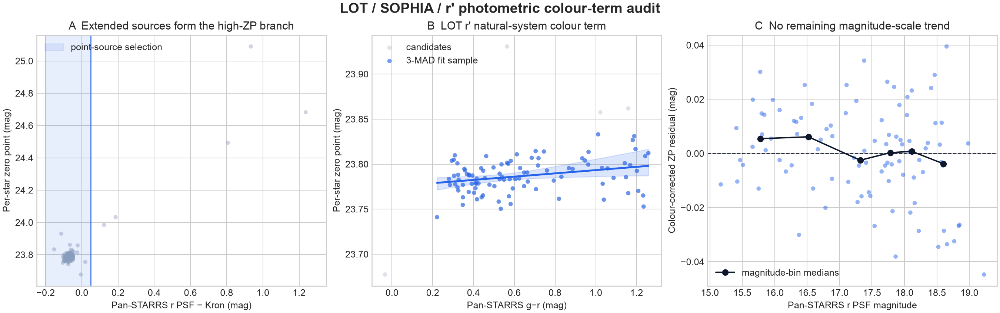

# LOT r' photometric colour-term audit

The end-to-end field also tests whether calibrating LOT's natural Astrodon r'
response directly against Pan-STARRS r introduces a stellar-colour bias. This
is a count-rate calibration test, separate from the SNR residual test in
`ENDTOEND_RESIDUALS.md`.



## Selection

The fit starts from the 299 saturation-safe stars, requires measured SNR >=
20, valid Pan-STARRS g/r/i colours, and uses
`-0.20 < r_PSF - r_Kron < 0.05` to select point sources. That last cut matters:
extended objects measured with a circular aperture form a separate zero-point
branch up to 1.4 mag high. Of 101 point-source candidates,
97 survive a three-MAD residual clip.

## Result

At the sample's median colour, `g-r = 0.571`, the observed
zero point is:

`ZP_r = 23.7855 + (+0.0182) * ((g-r) - 0.571)`

| Quantity | Estimate | Bootstrap 95% CI |
|---|---:|---:|
| Zero point at reference colour | 23.7855 mag | 23.7822 to 23.7896 |
| Colour coefficient | **+0.0182 mag per mag** | +0.0036 to +0.0423 |
| Residual scatter | 0.0174 mag | — |

The coefficient is small but resolved in this sample. One magnitude of g-r
changes the inferred count rate by +1.69%. Across the accepted
sample's central 90% colour range (0.30 to 1.20),
the full effect is 0.016 mag, or
1.51% in count rate.

The multi-night calibration in `lulin.py` predicts ZP =
23.7888 at this sample's median airmass
(1.038); this fit differs by -0.0033 mag. That is
an internal consistency check, not independent evidence, because both use the
same LOT field.

## Consequence

This is too small to explain LOT's factor-1.8 r' throughput excess over g' and
i'. It does show that future throughput fits should include a colour term and a
point-source morphology cut. The present r' throughput need not move: its
reference-colour zero point agrees with the existing multi-night relation to
well below one percent. A multi-band fit over independent fields is still
needed before adopting coefficients in the calculator itself.

Regenerate with:

```bash
uv run --with pandas --with matplotlib python validation/analyze_lot_color_term.py
```
