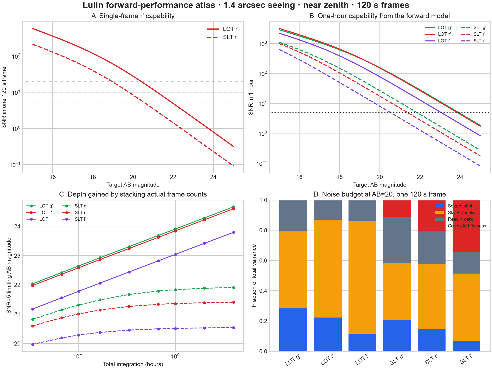

# Lulin forward-performance atlas

This compares LOT/Sophia and SLT/DU934P by evaluating CASTOR's forward noise
equation over actual integer stacks. It deliberately does not call the inverse
exposure solver audited in `SOLVE_TIME_FLATNESS.md`.



## Standard scene

Point source, AB magnitudes, g'/r'/i', 120 s sub-exposures, 1.4 arcsec seeing,
0.85xFWHM aperture, 3–5xFWHM median sky annulus, fixed target near zenith at
Lulin, no lunar term, and each filter's current preset sky and throughput.

| Telescope | Band | SNR=5, 120 s | SNR=5, 1 h | SNR=5, 4 h | SNR=10, 1 h |
|---|---|---:|---:|---:|---:|
| LOT | g' | 22.03 | 23.91 | 24.66 | 23.15 |
| LOT | r' | 21.98 | 23.84 | 24.60 | 23.09 |
| LOT | i' | 21.17 | 23.04 | 23.79 | 22.28 |
| SLT | g' | 20.82 | 21.84 | 21.91 | 21.08 |
| SLT | r' | 20.60 | 21.36 | 21.40 | 20.61 |
| SLT | i' | 19.97 | 20.51 | 20.54 | 19.76 |

The one-hour curves show the expected aperture advantage of LOT. They also
show the consequence of model completeness: SLT carries a measured 2%
background-flatness floor and gains progressively less depth with long stacks,
while Sophia currently carries zero because no equivalent floor has been
measured for it. Zero means "not modelled", not evidence that LOT has no
correlated background residual.

At AB=20, sky photons dominate most 120 s configurations. Read noise matters
more for SLT because there are fewer source electrons, while the correlated
term is already visible in its one-frame variance and controls its long-stack
limit. Dark current is negligible in these particular 120 s cases.

## Limits on interpretation

These are conditional model predictions, not measured limiting magnitudes or
uncertainty intervals. They use the current top-hat filters, one pointing, one
seeing value and the site-wide 0.17 extinction fallback. Readout overhead is
not modelled. Saturation uses the preset physical full well; LOT frames in the
end-to-end night actually hit their 16-bit ADC ceiling near 60,292 e-, so the
bright boundary in the CSV is optimistic for that operating mode.

Regenerate with:

```bash
uv run --with pandas --with matplotlib python validation/analyze_lulin_performance.py
```
