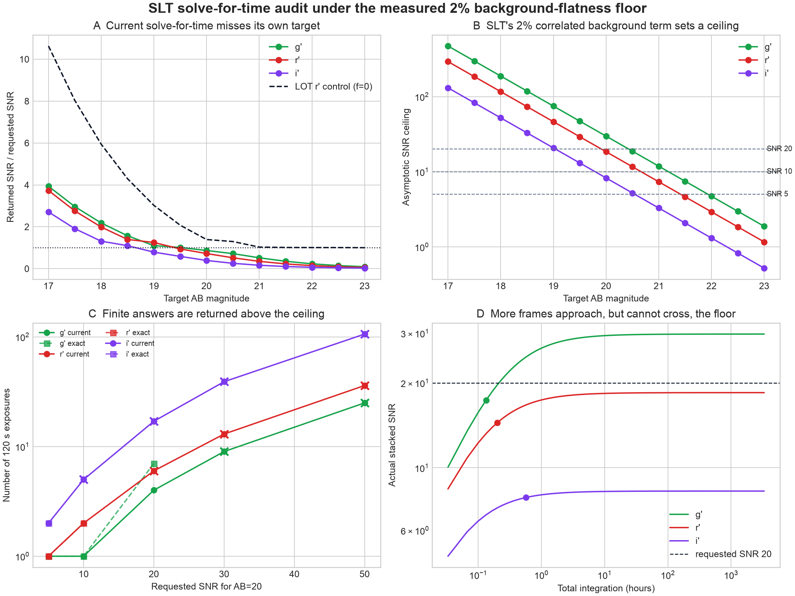
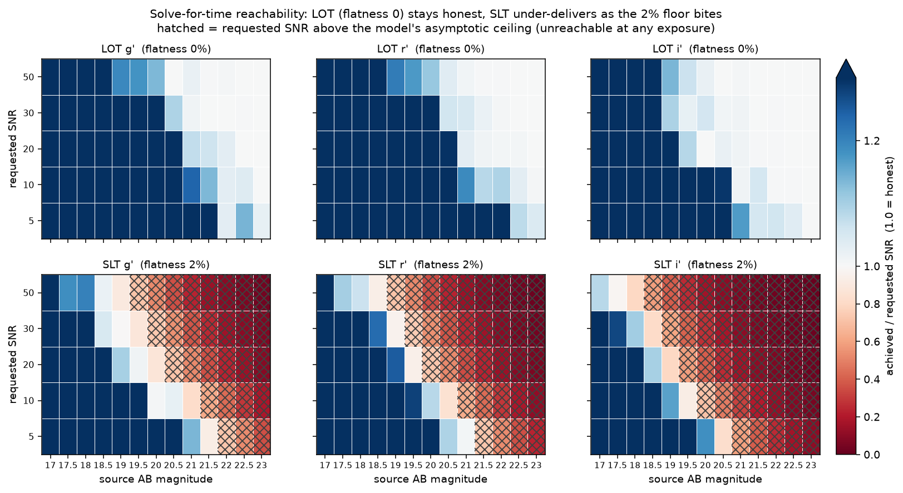

# Solve-for-time versus the correlated background floor

The SLT DU934P preset now carries the 2% background-flatness residual measured
from real extended-source data. CASTOR correctly includes that non-averaging
term when it computes a stack's SNR, but still solves the number of exposures
with `N = (target_snr / single_snr)^2`. That square-root law is valid only when
every variance term is independent between frames.



The single operating point above is one cell of a larger grid. Sweeping
LOT/SLT x g'/r'/i' x AB 17-23 x requested SNR 5-50 shows where the defect
lives:



Colour is achieved-over-requested SNR, so 1.0 is honest, blue is a harmless
integer-frame overshoot, and red is a request the solver accepts but
undershoots. The LOT row (flatness 0) is honest everywhere because the old
sqrt(N) law is still exact there. The SLT row turns red across a wide band of
faint targets and high SNR goals, and the hatched cells are requests above the
model's asymptotic ceiling, unreachable at any exposure. Worst case is SLT i'
at AB 23, SNR 50, where the current answer delivers 1% of the request.
Regenerate with
`uv run --with pandas --with matplotlib python validation/analyze_solve_reachability.py`.

## Concrete result

Standard case: SLT/DU934P, AB=20 point source, 120 s frames, 1.4 arcsec seeing,
0.85xFWHM aperture, 3–5xFWHM median annulus, the Lulin preset's own sky, target
near zenith, and requested SNR 20.

| Band | Model's asymptotic SNR ceiling | Current answer (frames) | SNR actually returned | Correct answer |
|---|---:|---:|---:|---:|
| g' | 29.78 | 4 | 17.35 | 7 |
| r' | 18.46 | 6 | 14.44 | unreachable |
| i' | 8.27 | 17 | 7.84 | unreachable |

The r' call is self-contradictory in one response: it says six exposures are
required and reports total SNR 14.44,
below the requested 20. The i' target is farther beyond its ceiling. The g'
target is reachable, but needs 7
frames rather than 4; the current
answer reaches only 17.35.

LOT is the control: Sophia's preset has `background_flatness_fraction = 0`, so
the old square-root law remains exact and its achieved/requested curve never
falls below one. Bright cases can overshoot because one indivisible frame
already exceeds the requested SNR.

## Correct algebra

For one frame, let `S` be source electrons, `V` the sum of every independent
variance term, and `F` the correlated flatness-noise amplitude. A stack of N
frames has

`SNR(N) = N*S / sqrt(N*V + N^2*F^2)`

and therefore the ceiling `S/F`. For a requested SNR `Q`:

`N = Q^2*V / (S^2 - Q^2*F^2)`

If the denominator is zero or negative, no finite exposure count can reach the
request under the model. The analysis table evaluates both the current and the
correct expression over LOT/SLT, g'/r'/i', AB 17–23 and target SNR 5–50.

## Consequence

This should be fixed before using solve-for-time with any camera whose
`background_flatness_fraction` is nonzero. The forward SNR calculation is
internally consistent; only the inverse solver assumes the superseded noise
law. A strict expected-failure test records the contradiction without silently
changing the engine as part of this analysis.

Regenerate with:

```bash
uv run --with pandas --with matplotlib python validation/analyze_solve_time_floor.py
```
